Social Media
================
Satya Shiva Sai Ram Kamma
2024-03-25

``` r
library(readxl)
```

    ## Warning: package 'readxl' was built under R version 4.3.2

``` r
library(dplyr)
```

    ## 
    ## Attaching package: 'dplyr'

    ## The following objects are masked from 'package:stats':
    ## 
    ##     filter, lag

    ## The following objects are masked from 'package:base':
    ## 
    ##     intersect, setdiff, setequal, union

``` r
library(FactoMineR)
```

    ## Warning: package 'FactoMineR' was built under R version 4.3.3

``` r
library(factoextra)
```

    ## Warning: package 'factoextra' was built under R version 4.3.2

    ## Loading required package: ggplot2

    ## Welcome! Want to learn more? See two factoextra-related books at https://goo.gl/ve3WBa

``` r
social_media <- read_excel("social_media_cleaned.xlsx")

social_media_numeric <- select_if(social_media, is.numeric)

# Perform PCA
pca_result <- prcomp(social_media_numeric, scale = TRUE)

# Scree plot
plot(pca_result$sdev^2, type = "b", xlab = "Principal Component", ylab = "Variance Explained")
```

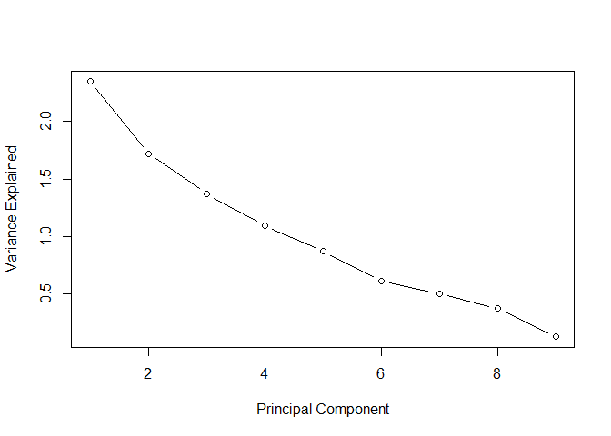<!-- -->

``` r
#From PCA variate representation of each PC, It’s evident that PC1 and PC2 add arround 50% of the to total variance

plot(pca_result$sdev^2, xlab = "Component number", ylab = "Component variance", type = "l", main = "Scree diagram")
```

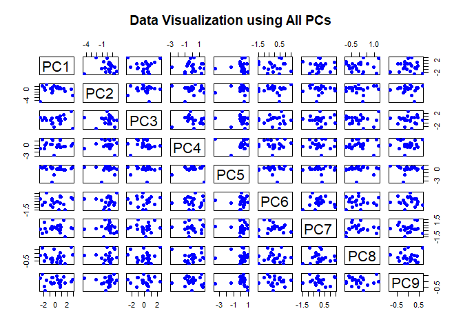<!-- -->

``` r
# Loadings
loadings <- pca_result$rotation
print(loadings)
```

    ##                                       PC1         PC2         PC3         PC4
    ## Instagram                      0.41464184  0.02024349 -0.26383045  0.40114808
    ## LinkedIn                       0.29217292  0.38506533  0.15123613 -0.28513889
    ## SnapChat                       0.25433387 -0.24590367 -0.29660999  0.15262675
    ## Twitter                       -0.28013061  0.22218671 -0.50324467 -0.25891260
    ## Whatsapp/Wechat                0.39300602  0.15602394  0.22649362  0.21201973
    ## youtube                        0.27449134  0.38974184  0.19573161  0.20908153
    ## OTT                            0.05887065  0.36765414 -0.50670371  0.06248821
    ## Reddit                        -0.13017449  0.22001689 -0.21853542 -0.04431012
    ## Trouble_falling_asleep         0.30661910 -0.32654537 -0.32456213  0.09152823
    ## Mood Productivity              0.35430862  0.07464005 -0.22037175 -0.41690878
    ## Tired waking up in morning     0.12383630 -0.51575921 -0.05145166 -0.18392420
    ## How you felt the entire week?  0.33830839 -0.05873321  0.12498115 -0.59740380
    ##                                       PC5         PC6         PC7          PC8
    ## Instagram                     -0.07164143 -0.07277191 -0.27803592 -0.325410941
    ## LinkedIn                       0.22198557  0.14076272  0.30834581 -0.187758901
    ## SnapChat                       0.13403459  0.16886311  0.72273506  0.042206980
    ## Twitter                        0.20163164 -0.24131742 -0.16599189  0.004223787
    ## Whatsapp/Wechat               -0.40513253 -0.31770624  0.10652086  0.300422648
    ## youtube                        0.27328621  0.24851748 -0.36090468  0.205235322
    ## OTT                           -0.01564733 -0.20469695  0.09877191  0.522778157
    ## Reddit                        -0.52696344  0.75425195 -0.03031190  0.055511686
    ## Trouble_falling_asleep         0.35469619  0.25794239 -0.26114833 -0.023627825
    ## Mood Productivity             -0.37584104 -0.19081453 -0.06770024 -0.454584222
    ## Tired waking up in morning    -0.26563533 -0.01778508 -0.21519479  0.385609332
    ## How you felt the entire week?  0.18052230  0.10670264 -0.07972117  0.303976225
    ##                                       PC9        PC10        PC11        PC12
    ## Instagram                      0.23790068  0.07998839  0.53721890  0.22784323
    ## LinkedIn                       0.52007809  0.26496357 -0.23696134  0.25675523
    ## SnapChat                      -0.12571349 -0.40210181  0.06398674  0.10668550
    ## Twitter                       -0.17040670 -0.17399436 -0.08766026  0.59867488
    ## Whatsapp/Wechat               -0.36650911  0.19398830 -0.23609485  0.36135831
    ## youtube                       -0.02148073 -0.59467974 -0.15686464 -0.05655012
    ## OTT                            0.22016248  0.17263960  0.04725589 -0.44159213
    ## Reddit                        -0.08611490  0.08806585  0.03611781  0.13365388
    ## Trouble_falling_asleep        -0.23614873  0.40672261 -0.44538755 -0.07053290
    ## Mood Productivity             -0.11989066 -0.28008933 -0.22008935 -0.34111244
    ## Tired waking up in morning     0.54060554 -0.22156677 -0.17530413  0.21029053
    ## How you felt the entire week? -0.27387540  0.09816128  0.53107506  0.01309173

``` r
# Data projection onto all PCs
data_projection_all <- as.data.frame(pca_result$x)

# Matrix scatterplot for pairs of principal components
pairs(data_projection_all, col = "blue", pch = 19,
      main = "Data Visualization using All PCs")
```

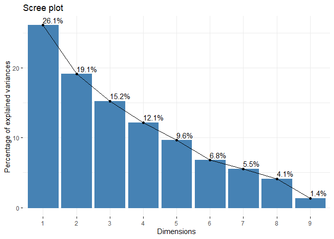<!-- -->

``` r
# Visualize Eigenvalues
fviz_eig(pca_result, addlabels = TRUE)
```

<!-- -->

``` r
# Visualize Variable Quality
fviz_pca_var(pca_result, col.var = "cos2",
             gradient.cols = c("#00AFBB", "#E7B800", "#FC4E07"), 
             repel = TRUE)
```

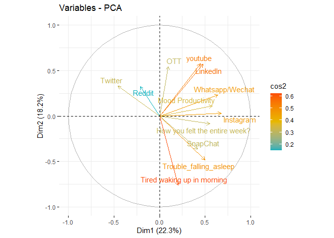<!-- -->

``` r
# Visualize Individual Contributions
fviz_pca_ind(pca_result,
             geom.ind = "point", # Show points only
             palette = c("#00AFBB", "#E7B800", "#FC4E07"),
             addEllipses = TRUE, # Concentration ellipses
             legend.title = "Groups"
             )
```

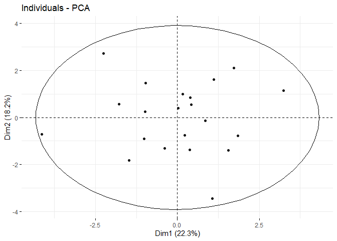<!-- -->

``` r
# Biplot
biplot(pca_result)
```

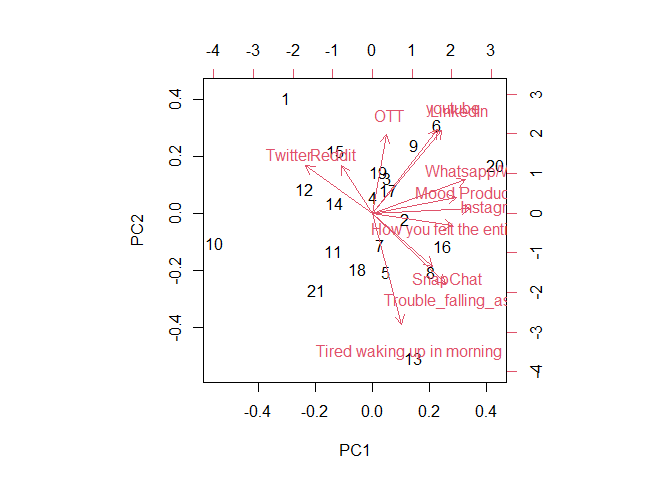<!-- -->

``` r
# Variable correlation plot (Correlation Circle)
fviz_pca_var(pca_result, col.var = "black")
```

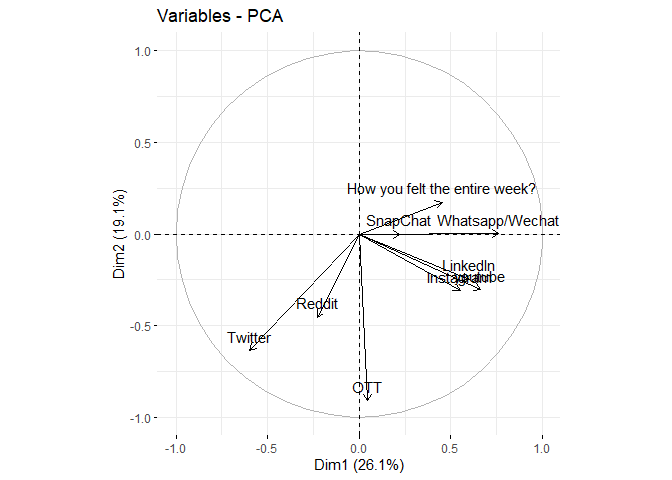<!-- -->

``` r
# Quality of representation of variables on dimensions 1 and 2
fviz_cos2(pca_result, choice = "var", axes = 1:2)
```

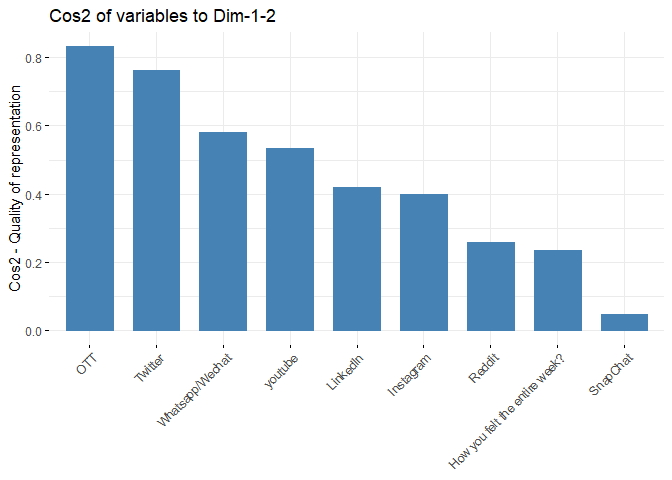<!-- -->

``` r
# Contributions of variables to principal components
fviz_contrib(pca_result, choice = "var", axes = 1, top = 10)
```

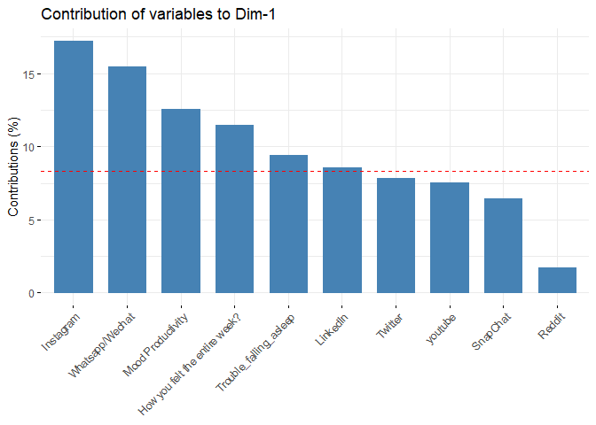<!-- -->

``` r
fviz_contrib(pca_result, choice = "var", axes = 2, top = 10)
```

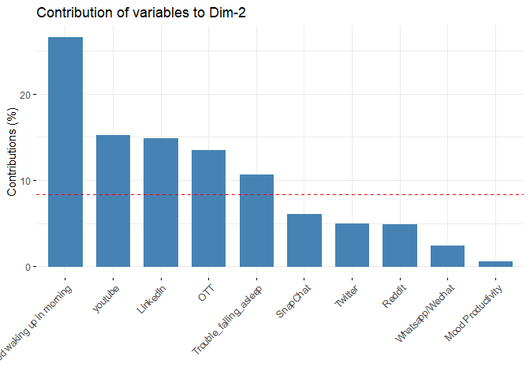<!-- -->

``` r
# Visualize individual contributions
fviz_pca_ind(pca_result,
             geom.ind = "point", # Show points only
             palette = c("#00AFBB", "#E7B800", "#FC4E07"),
             addEllipses = TRUE, # Concentration ellipses
             legend.title = "Groups"
             )
```

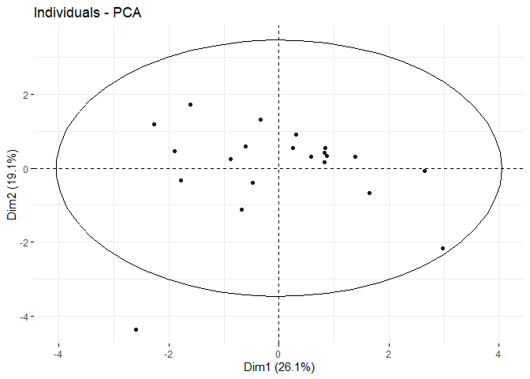<!-- -->

``` r
library(scatterplot3d)
scatterplot3d(pca_result$x[,1:3], color = social_media$Instagram)
```

<!-- -->

### Cluster Analysis

``` r
library(readxl)
library(factoextra)
library(ggplot2)
library(factoextra)
library(ggfortify)
```

    ## Warning: package 'ggfortify' was built under R version 4.3.3

``` r
library(MASS)
```

    ## 
    ## Attaching package: 'MASS'

    ## The following object is masked from 'package:dplyr':
    ## 
    ##     select

``` r
library(ggrepel)
```

    ## Warning: package 'ggrepel' was built under R version 4.3.2

``` r
library(stats)


social_media_cluster <- read_excel("social_media_cleaned.xlsx")
data.scaled <- scale(x = social_media_cluster[, -1], center = TRUE, scale = TRUE)
data <- data.scaled
head(data)
```

    ##       Instagram   LinkedIn   SnapChat     Twitter Whatsapp/Wechat    youtube
    ## [1,] -0.6888867  0.1519097 -0.2810325  3.42451853      -1.3480276 -0.2719612
    ## [2,]  0.5146906  0.6366870  0.4933528 -0.44951033      -0.5576781  0.7352180
    ## [3,] -0.6130708  1.3638528 -0.4157082 -0.44951033       0.8450887 -0.6460563
    ## [4,] -0.1534369  0.6838181 -0.1944552 -0.44951033      -0.2804351 -0.5597267
    ## [5,]  1.7277449 -1.2283589 -0.5696232  0.06702685      -0.8514729  0.3035697
    ## [6,] -1.0205812  1.3638528 -0.4349475 -0.44951033       1.3830228  2.3179281
    ##             OTT     Reddit Trouble_falling_asleep Mood Productivity
    ## [1,]  3.4382238  1.2405563             -0.6900656         0.2182179
    ## [2,] -0.6686547 -0.3292004              1.3801311         0.2182179
    ## [3,] -0.1021887 -0.3292004             -0.6900656         0.2182179
    ## [4,] -0.1021887 -0.3292004             -0.6900656         0.2182179
    ## [5,] -0.1021887  0.2987023              1.3801311         0.2182179
    ## [6,]  0.1810443 -0.3292004             -0.6900656         0.2182179
    ##      Tired waking up in morning How you felt the entire week?
    ## [1,]                 -0.6900656                    -0.5741693
    ## [2,]                 -0.6900656                    -0.5741693
    ## [3,]                 -0.6900656                     0.7655590
    ## [4,]                 -0.6900656                     0.7655590
    ## [5,]                  1.3801311                    -0.5741693
    ## [6,]                 -0.6900656                     2.1052873

``` r
# Perform PCA
pc <- prcomp(data.scaled)
pc_first_three <- pc$x[, 1:3]
# Perform K-means clustering on the first three principal components
set.seed(123)  # For reproducibility
k <- 3  # Number of clusters
km_clusters <- kmeans(pc_first_three, centers = k)

# Define colors for each cluster
cluster_colors <- c("red", "blue", "green")

# Plot the first three principal components with cluster assignments
plot(pc_first_three, col = cluster_colors[km_clusters$cluster], 
     main = "First Three Principal Components with Cluster Assignments", 
     xlab = "", ylab = "", pch = 20)
```

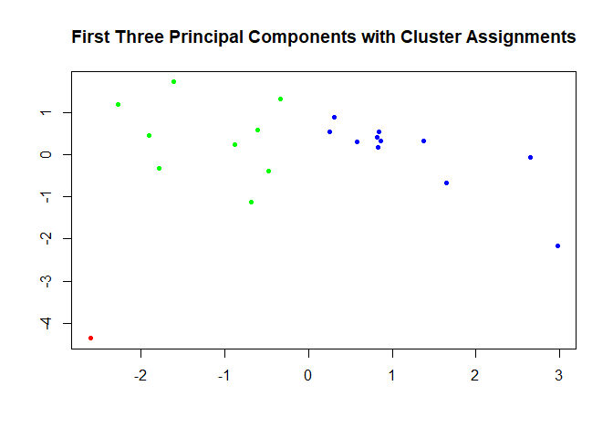<!-- -->
<p>
It is first performs Principal Component Analysis (PCA) on scaled data,
reducing its dimensionality.
</p>
<p>
Then, it extracts the first three principal components. Next, it applies
K-means clustering to these components, dividing data into three
clusters.
</p>
<p>
Finally, it plots the first three principal components with color-coded
cluster assignments for visualization and analysis
</p>

``` r
# Take a subset of 20 rows
data_subset <- data[1:20, ]

# Perform PCA
pca_result <- prcomp(data_subset)

# Extract the first three principal components
pc_first_three <- pca_result$x[, 1:3]

# Perform hierarchical clustering on the first three principal components
hc <- hclust(dist(pc_first_three))

# Plot the dendrogram
plot(hc, main = "Dendrogram of Hierarchical Clustering (Subset of 20 Rows)",
     xlab = "Sample Index", ylab = "Distance", sub = NULL)
```

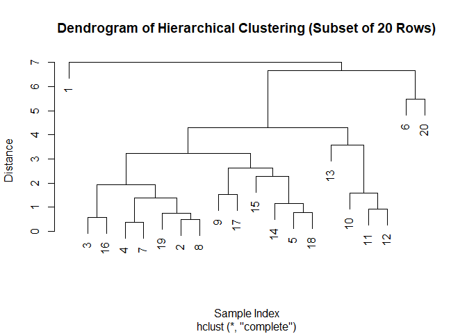<!-- -->

<p>
The plot shows the first three principal components, performs
hierarchical clustering on them, and plots a dendrogram showing the
relationships between the samples based on their distances in the
reduced-dimensional space.
</p>

``` r
# Visualize cluster and membership using first two Principal Components
fviz_cluster(list(data = pc$x[, 1:2], cluster = km_clusters$cluster))
```

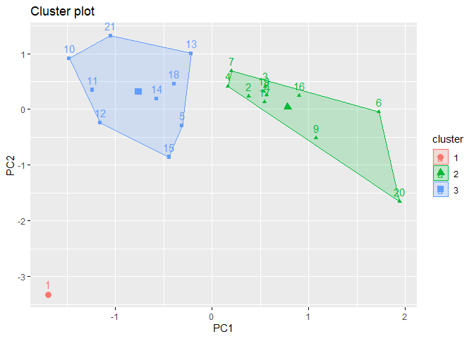<!-- -->

<p>
This plot visualizes clustering results by plotting data points in a
two-dimensional space using the first two Principal Components. Each
point is colored according to its assigned cluster, showing the grouping
pattern identified by the clustering algorithm. It helps understand how
data points are grouped based on their features.
</p>

``` r
# Non-hierarchical clustering (k-means)
num_clusters <- 2  
kmeans_model <- kmeans(data, centers = num_clusters)

# Membership for each cluster
table(kmeans_model$cluster)
```

    ## 
    ##  1  2 
    ## 17  4

<p>
This represents clustering using the k-means algorithm, dividing data
into two clusters. It initializes cluster centers randomly, assigning
each data point to the nearest cluster. The table function counts the
number of data points assigned to each cluster, providing insight into
cluster membership and distribution.
</p>
<b>
<p>
This represents clustering using the k-means algorithm, dividing data
into two clusters. It initializes cluster centers randomly, assigning
each data point to the nearest cluster. The table function counts the
number of data points assigned to each cluster, providing insight into
cluster membership and distribution.
</p>

</b>

``` r
# Visualize cluster and membership using first two Principal Components
fviz_cluster(list(data = pc$x[, 1:2], cluster = kmeans_model$cluster))
```

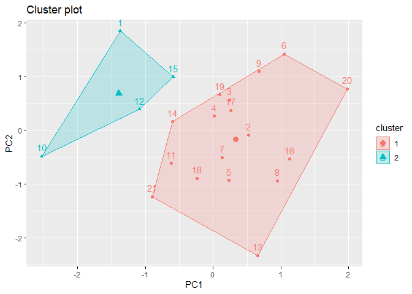<!-- -->
<p>
This plot visualizes clusters and their memberships using the first two
principal components. It extracts these components from the data, then
assigns each data point to a cluster using k-means clustering. Finally,
it creates a visual representation showing how the data points are
grouped based on their similarities in the first two principal
components.
</p>
<b>
<p>
What is the relationship between the clustering results obtained through
k-means algorithm and the underlying structure of the data as revealed
by Principal Component Analysis (PCA)?
</p>

</b>

``` r
# Visualize cluster and membership using first two Principal Components for k-means
pca_result <- prcomp(data, scale = TRUE)
fviz_cluster(kmeans_model, data = pca_result$x[, 1:2], geom = "point", 
             pointsize = 2, fill = "white", main = "K-means Clustering Result (PCA)")
```

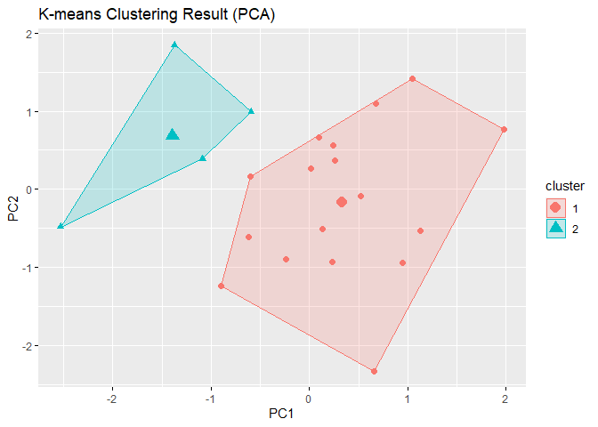<!-- -->
<p>
This shows visualization of the clusters and their memberships using the
first two Principal Components (PCs) obtained from the PCA (Principal
Component Analysis) of the numerical data. First, it computes the PCA
result for the numerical data and scales it. Then, it uses the
fviz_cluster function to plot the clusters obtained from the k-means
algorithm (kmeans_model). It represents each data point as a point on
the plot, with the size set to 2 and colored white. The plot is titled
“K-means Clustering Result (PCA)”. This visualization helps to
understand how the data points are grouped into clusters based on their
similarities, as revealed by the PCA analysis.
</p>
<p>
What is the relationship between the number of clusters (k) and the
average silhouette width in k-means clustering, and how does this
relationship inform the determination of the optimal number of clusters
for a given dataset?
</p>

``` r
library(factoextra)
library(cluster)

# Calculate silhouette information for k-means clustering
sil <- silhouette(kmeans_model$cluster, dist(data))

# Visualize the silhouette plot for k-means clustering
fviz_silhouette(sil, main = "Silhouette Plot for K-means Clustering")
```

    ##   cluster size ave.sil.width
    ## 1       1   17          0.26
    ## 2       2    4         -0.06

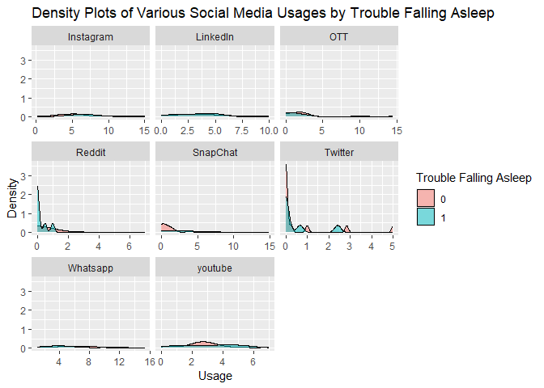<!-- -->

<p>
This plot calculates and visualizes the silhouette information for
k-means clustering. Silhouette analysis helps evaluate the quality of
clustering by measuring how similar an object is to its own cluster
compared to other clusters. A higher silhouette width indicates better
separation of clusters, while negative values suggest that points might
be assigned to the wrong clusters. This plot helps in determining the
optimal number of clusters for k-means clustering and assessing the
overall clustering performance.
</p>

``` r
# Create a data frame with cluster membership
data_clustered <- data.frame(data, Cluster = kmeans_model$cluster)  # Ensure conversion to data frame

# Scatter plot of data points colored by cluster membership
plot(data_clustered$Whatsapp.Wechat, data_clustered$youtube, 
     col = data_clustered$Cluster, pch = 17, 
     xlab = "Whatsapp", ylab = "Youtube",  
     main = "Scatter Plot of Clustering")
legend("topright", legend = unique(data_clustered$Cluster), 
       col = 1:max(data_clustered$Cluster), pch = 17, title = "Cluster")
```

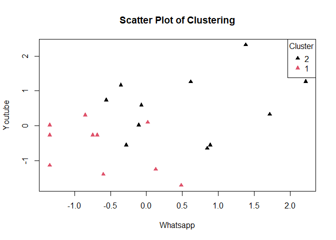<!-- -->
<p>
Overall, this plot visualizes clusters in the data, helping us
understand how data points group together based on the Whatsapp and
Youtube, with each group represented by a different color on the plot.
</p>

### Factor Analysis

``` r
library(ggplot2)
library(psych)
```

    ## Warning: package 'psych' was built under R version 4.3.3

    ## 
    ## Attaching package: 'psych'

    ## The following objects are masked from 'package:ggplot2':
    ## 
    ##     %+%, alpha

``` r
fa.parallel(social_media_numeric)
```

    ## Warning in fa.stats(r = r, f = f, phi = phi, n.obs = n.obs, np.obs = np.obs, :
    ## The estimated weights for the factor scores are probably incorrect.  Try a
    ## different factor score estimation method.

    ## Warning in fac(r = r, nfactors = nfactors, n.obs = n.obs, rotate = rotate, : An
    ## ultra-Heywood case was detected.  Examine the results carefully

    ## Warning in cor(sampledata, use = use): the standard deviation is zero

    ## Warning in cor(sampledata, use = use): the standard deviation is zero

    ## Warning in cor(sampledata, use = use): the standard deviation is zero

    ## Warning in fa.stats(r = r, f = f, phi = phi, n.obs = n.obs, np.obs = np.obs, :
    ## The estimated weights for the factor scores are probably incorrect.  Try a
    ## different factor score estimation method.

    ## Warning in fac(r = r, nfactors = nfactors, n.obs = n.obs, rotate = rotate, : An
    ## ultra-Heywood case was detected.  Examine the results carefully

    ## Warning in fa.stats(r = r, f = f, phi = phi, n.obs = n.obs, np.obs = np.obs, :
    ## The estimated weights for the factor scores are probably incorrect.  Try a
    ## different factor score estimation method.

    ## Warning in fac(r = r, nfactors = nfactors, n.obs = n.obs, rotate = rotate, : An
    ## ultra-Heywood case was detected.  Examine the results carefully

    ## Warning in cor(sampledata, use = use): the standard deviation is zero

    ## Warning in cor(sampledata, use = use): the standard deviation is zero

    ## Warning in fa.stats(r = r, f = f, phi = phi, n.obs = n.obs, np.obs = np.obs, :
    ## The estimated weights for the factor scores are probably incorrect.  Try a
    ## different factor score estimation method.

    ## Warning in fac(r = r, nfactors = nfactors, n.obs = n.obs, rotate = rotate, : An
    ## ultra-Heywood case was detected.  Examine the results carefully

    ## Warning in cor(sampledata, use = use): the standard deviation is zero

    ## Warning in cor(sampledata, use = use): the standard deviation is zero

    ## Warning in cor(sampledata, use = use): the standard deviation is zero

    ## Warning in cor(sampledata, use = use): the standard deviation is zero

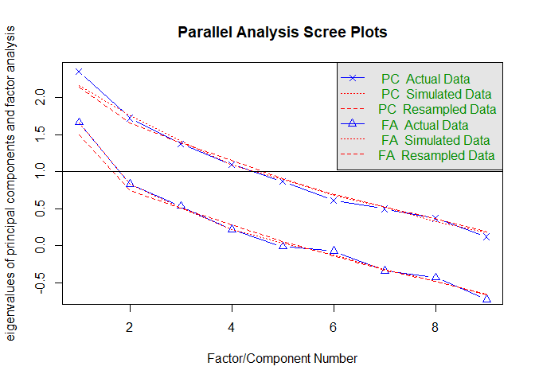<!-- -->

    ## Parallel analysis suggests that the number of factors =  0  and the number of components =  0

<p>
Parallel analysis suggests that the number of factors = 0 and the number
of components = 0
</p>

``` r
fit.pc <- principal(social_media_numeric, nfactors=2, rotate="varimax")
fit.pc
```

    ## Principal Components Analysis
    ## Call: principal(r = social_media_numeric, nfactors = 2, rotate = "varimax")
    ## Standardized loadings (pattern matrix) based upon correlation matrix
    ##                                 RC1   RC2   h2   u2 com
    ## Instagram                      0.56  0.39 0.46 0.54 1.8
    ## LinkedIn                       0.73 -0.16 0.55 0.45 1.1
    ## SnapChat                       0.11  0.54 0.31 0.69 1.1
    ## Twitter                       -0.16 -0.54 0.32 0.68 1.2
    ## Whatsapp/Wechat                0.65  0.21 0.47 0.53 1.2
    ## youtube                        0.71 -0.18 0.53 0.47 1.1
    ## OTT                            0.41 -0.37 0.30 0.70 2.0
    ## Reddit                         0.03 -0.39 0.15 0.85 1.0
    ## Trouble_falling_asleep         0.10  0.69 0.48 0.52 1.0
    ## Mood Productivity              0.53  0.27 0.35 0.65 1.5
    ## Tired waking up in morning    -0.30  0.73 0.62 0.38 1.3
    ## How you felt the entire week?  0.39  0.41 0.31 0.69 2.0
    ## 
    ##                        RC1  RC2
    ## SS loadings           2.49 2.37
    ## Proportion Var        0.21 0.20
    ## Cumulative Var        0.21 0.40
    ## Proportion Explained  0.51 0.49
    ## Cumulative Proportion 0.51 1.00
    ## 
    ## Mean item complexity =  1.4
    ## Test of the hypothesis that 2 components are sufficient.
    ## 
    ## The root mean square of the residuals (RMSR) is  0.16 
    ##  with the empirical chi square  72.39  with prob <  0.0033 
    ## 
    ## Fit based upon off diagonal values = 0.56

<p>
High absolute values (close to 1) indicate a strong relationship between
the variable and the factor. \#h2 explains how much variance of the
variables are explained by the factors. \#u2 indicates the amount of
variance not explained by the factors Principal Components Analysis
Call: principal(r = social_media_numeric, nfactors = 2, rotate =
“varimax”) Standardized loadings (pattern matrix) based upon correlation
matrix
</p>
<p>
SS loadings 2.27 1.80 Proportion Var 0.25 0.20 Cumulative Var 0.25 0.45
Proportion Explained 0.56 0.44 Cumulative Proportion 0.56 1.00
</p>
<p>
Mean item complexity = 1.3 Test of the hypothesis that 2 components are
sufficient.
</p>
<p>

The root mean square of the residuals (RMSR) is 0.14 with the empirical
chi square 29.01 with prob \< 0.066

</p>

``` r
round(fit.pc$values, 3)
```

    ##  [1] 2.676 2.183 1.764 1.378 0.971 0.851 0.805 0.587 0.401 0.229 0.120 0.035

``` r
fit.pc$loadings
```

    ## 
    ## Loadings:
    ##                               RC1    RC2   
    ## Instagram                      0.556  0.389
    ## LinkedIn                       0.725 -0.161
    ## SnapChat                       0.109  0.541
    ## Twitter                       -0.164 -0.539
    ## Whatsapp/Wechat                0.650  0.208
    ## youtube                        0.707 -0.184
    ## OTT                            0.407 -0.373
    ## Reddit                               -0.388
    ## Trouble_falling_asleep         0.104  0.688
    ## Mood Productivity              0.527  0.265
    ## Tired waking up in morning    -0.303  0.728
    ## How you felt the entire week?  0.386  0.406
    ## 
    ##                  RC1   RC2
    ## SS loadings    2.494 2.366
    ## Proportion Var 0.208 0.197
    ## Cumulative Var 0.208 0.405

``` r
fit.pc$communality
```

    ##                     Instagram                      LinkedIn 
    ##                     0.4609883                     0.5521648 
    ##                      SnapChat                       Twitter 
    ##                     0.3051221                     0.3177808 
    ##               Whatsapp/Wechat                       youtube 
    ##                     0.4664790                     0.5332625 
    ##                           OTT                        Reddit 
    ##                     0.3043824                     0.1510324 
    ##        Trouble_falling_asleep             Mood Productivity 
    ##                     0.4843960                     0.3481044 
    ##    Tired waking up in morning How you felt the entire week? 
    ##                     0.6217976                     0.3138161

``` r
# Rotated factor scores, Notice the columns ordering: RC1, RC2
fit.pc
```

    ## Principal Components Analysis
    ## Call: principal(r = social_media_numeric, nfactors = 2, rotate = "varimax")
    ## Standardized loadings (pattern matrix) based upon correlation matrix
    ##                                 RC1   RC2   h2   u2 com
    ## Instagram                      0.56  0.39 0.46 0.54 1.8
    ## LinkedIn                       0.73 -0.16 0.55 0.45 1.1
    ## SnapChat                       0.11  0.54 0.31 0.69 1.1
    ## Twitter                       -0.16 -0.54 0.32 0.68 1.2
    ## Whatsapp/Wechat                0.65  0.21 0.47 0.53 1.2
    ## youtube                        0.71 -0.18 0.53 0.47 1.1
    ## OTT                            0.41 -0.37 0.30 0.70 2.0
    ## Reddit                         0.03 -0.39 0.15 0.85 1.0
    ## Trouble_falling_asleep         0.10  0.69 0.48 0.52 1.0
    ## Mood Productivity              0.53  0.27 0.35 0.65 1.5
    ## Tired waking up in morning    -0.30  0.73 0.62 0.38 1.3
    ## How you felt the entire week?  0.39  0.41 0.31 0.69 2.0
    ## 
    ##                        RC1  RC2
    ## SS loadings           2.49 2.37
    ## Proportion Var        0.21 0.20
    ## Cumulative Var        0.21 0.40
    ## Proportion Explained  0.51 0.49
    ## Cumulative Proportion 0.51 1.00
    ## 
    ## Mean item complexity =  1.4
    ## Test of the hypothesis that 2 components are sufficient.
    ## 
    ## The root mean square of the residuals (RMSR) is  0.16 
    ##  with the empirical chi square  72.39  with prob <  0.0033 
    ## 
    ## Fit based upon off diagonal values = 0.56

``` r
fit.pc$scores
```

    ##               RC1        RC2
    ##  [1,]  0.03152026 -2.3010655
    ##  [2,]  0.36294009  0.3883794
    ##  [3,]  0.53677836 -0.3028726
    ##  [4,]  0.17219105 -0.1995664
    ##  [5,] -0.38726442  0.8816096
    ##  [6,]  1.69693355 -0.4887786
    ##  [7,] -0.20079571  0.4843012
    ##  [8,]  0.18221986  1.3207815
    ##  [9,]  1.20640012 -0.4572010
    ## [10,] -2.30030270 -1.1572244
    ## [11,] -0.86395523  0.1114352
    ## [12,] -0.62706223 -0.9675326
    ## [13,] -0.89610952  2.2463127
    ## [14,] -0.38157128 -0.4965518
    ## [15,]  0.13564058 -1.1499638
    ## [16,]  0.57178788  1.1075723
    ## [17,]  0.43480529 -0.1367564
    ## [18,] -0.72969671  0.5643957
    ## [19,]  0.48277403 -0.4673222
    ## [20,]  2.03958577  0.5916007
    ## [21,] -1.46681906  0.4284470

``` r
fa.plot(fit.pc)
```

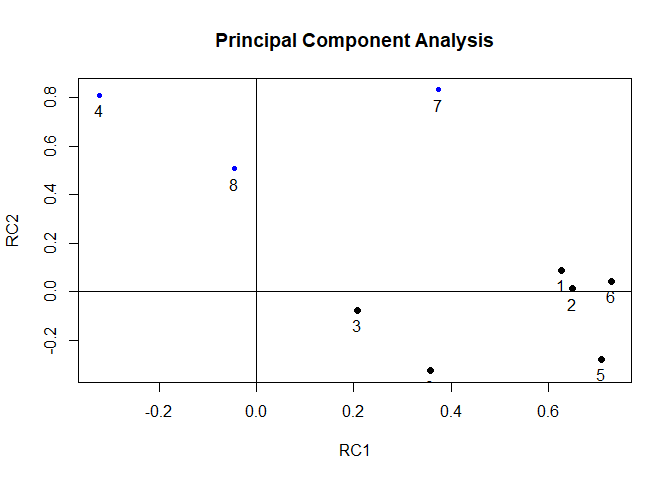<!-- -->

``` r
fa.diagram(fit.pc) # Visualize the relationship
```

<!-- -->

``` r
vss(social_media_numeric)
```

    ## Warning in fa.stats(r = r, f = f, phi = phi, n.obs = n.obs, np.obs = np.obs, :
    ## The estimated weights for the factor scores are probably incorrect.  Try a
    ## different factor score estimation method.

    ## Warning in fa.stats(r = r, f = f, phi = phi, n.obs = n.obs, np.obs = np.obs, :
    ## The estimated weights for the factor scores are probably incorrect.  Try a
    ## different factor score estimation method.

    ## Warning in fac(r = r, nfactors = nfactors, n.obs = n.obs, rotate = rotate, : An
    ## ultra-Heywood case was detected.  Examine the results carefully

    ## Warning in fa.stats(r = r, f = f, phi = phi, n.obs = n.obs, np.obs = np.obs, :
    ## The estimated weights for the factor scores are probably incorrect.  Try a
    ## different factor score estimation method.

    ## Warning in fac(r = r, nfactors = nfactors, n.obs = n.obs, rotate = rotate, : An
    ## ultra-Heywood case was detected.  Examine the results carefully

    ## Warning in fa.stats(r = r, f = f, phi = phi, n.obs = n.obs, np.obs = np.obs, :
    ## The estimated weights for the factor scores are probably incorrect.  Try a
    ## different factor score estimation method.

    ## Warning in fac(r = r, nfactors = nfactors, n.obs = n.obs, rotate = rotate, : An
    ## ultra-Heywood case was detected.  Examine the results carefully

    ## Warning in fa.stats(r = r, f = f, phi = phi, n.obs = n.obs, np.obs = np.obs, :
    ## The estimated weights for the factor scores are probably incorrect.  Try a
    ## different factor score estimation method.

    ## Warning in fac(r = r, nfactors = nfactors, n.obs = n.obs, rotate = rotate, : An
    ## ultra-Heywood case was detected.  Examine the results carefully

    ## Warning in fa.stats(r = r, f = f, phi = phi, n.obs = n.obs, np.obs = np.obs, :
    ## The estimated weights for the factor scores are probably incorrect.  Try a
    ## different factor score estimation method.

    ## Warning in fac(r = r, nfactors = nfactors, n.obs = n.obs, rotate = rotate, : An
    ## ultra-Heywood case was detected.  Examine the results carefully

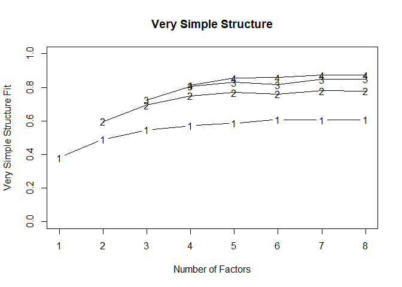<!-- -->

    ## 
    ## Very Simple Structure
    ## Call: vss(x = social_media_numeric)
    ## Although the VSS complexity 1 shows  8  factors, it is probably more reasonable to think about  5  factors
    ## VSS complexity 2 achieves a maximimum of 0.78  with  6  factors
    ## 
    ## The Velicer MAP achieves a minimum of 0.07  with  1  factors 
    ## BIC achieves a minimum of  -88.66  with  1  factors
    ## Sample Size adjusted BIC achieves a minimum of  7.84  with  7  factors
    ## 
    ## Statistics by number of factors 
    ##   vss1 vss2   map dof chisq  prob sqresid  fit RMSEA   BIC SABIC complex eChisq
    ## 1 0.33 0.00 0.067  54  75.7 0.027   13.27 0.33 0.130 -88.7  78.0     1.0  97.32
    ## 2 0.41 0.56 0.075  43  60.4 0.041    8.80 0.56 0.130 -70.5  62.2     1.4  55.37
    ## 3 0.50 0.66 0.086  33  43.8 0.098    5.77 0.71 0.115 -56.6  45.2     1.6  27.84
    ## 4 0.53 0.72 0.100  24  28.8 0.227    3.85 0.81 0.085 -44.2  29.8     1.6  11.34
    ## 5 0.55 0.74 0.125  16  20.4 0.201    2.85 0.86 0.104 -28.3  21.1     1.8   5.58
    ## 6 0.55 0.78 0.175   9  15.6 0.075    2.02 0.90 0.181 -11.8  16.0     1.7   3.32
    ## 7 0.54 0.72 0.209   3   7.7 0.052    1.74 0.91 0.269  -1.4   7.8     2.0   1.21
    ## 8 0.59 0.76 0.284  -2   4.9    NA    0.87 0.96    NA    NA    NA     1.9   0.41
    ##    SRMR eCRMS  eBIC
    ## 1 0.187 0.207 -67.1
    ## 2 0.141 0.175 -75.5
    ## 3 0.100 0.142 -72.6
    ## 4 0.064 0.106 -61.7
    ## 5 0.045 0.091 -43.1
    ## 6 0.035 0.094 -24.1
    ## 7 0.021 0.098  -7.9
    ## 8 0.012    NA    NA

<p>

Very Simple Structure Call: vss(x = social_media_numeric) VSS complexity
1 achieves a maximimum of 0.61 with 6 factors VSS complexity 2 achieves
a maximimum of 0.78 with 7 factors

The Velicer MAP achieves a minimum of 0.06 with 1 factors BIC achieves a
minimum of -53.17 with 1 factors Sample Size adjusted BIC achieves a
minimum of 1.47 with 5 factors

Statistics by number of factors

</p>

``` r
# Computing Correlation Matrix
corrm.social <- cor(social_media_numeric)
corrm.social
```

    ##                                 Instagram     LinkedIn    SnapChat     Twitter
    ## Instagram                      1.00000000  0.097056399  0.28968877 -0.19305653
    ## LinkedIn                       0.09705640  1.000000000  0.02552545 -0.13006846
    ## SnapChat                       0.28968877  0.025525452  1.00000000 -0.17995686
    ## Twitter                       -0.19305653 -0.130068464 -0.17995686  1.00000000
    ## Whatsapp/Wechat                0.37769615  0.228835623  0.08099980 -0.49583293
    ## youtube                        0.33000187  0.452197669 -0.16006877 -0.18817769
    ## OTT                            0.26738122  0.185492527  0.13158590  0.55707401
    ## Reddit                        -0.07461553 -0.006992884 -0.08116237  0.16490296
    ## Trouble_falling_asleep         0.50535856 -0.124658176  0.47446668 -0.07841779
    ## Mood Productivity              0.37498880  0.335447863  0.13051708  0.10299576
    ## Tired waking up in morning     0.06883078 -0.327465831  0.18918923 -0.27223450
    ## How you felt the entire week? -0.06488863  0.415506031  0.07962803 -0.14557124
    ##                               Whatsapp/Wechat      youtube           OTT
    ## Instagram                          0.37769615  0.330001869  0.2673812155
    ## LinkedIn                           0.22883562  0.452197669  0.1854925268
    ## SnapChat                           0.08099980 -0.160068767  0.1315859038
    ## Twitter                           -0.49583293 -0.188177691  0.5570740080
    ## Whatsapp/Wechat                    1.00000000  0.371685163  0.1336203696
    ## youtube                            0.37168516  1.000000000  0.1605652338
    ## OTT                                0.13362037  0.160565234  1.0000000000
    ## Reddit                            -0.13444966  0.026399913  0.2327910994
    ## Trouble_falling_asleep            -0.06304856  0.038656332 -0.0004560485
    ## Mood Productivity                  0.30887192 -0.003621212  0.1532080319
    ## Tired waking up in morning        -0.04248925 -0.355519106 -0.2213138016
    ## How you felt the entire week?      0.18772672  0.178774630 -0.1088494499
    ##                                     Reddit Trouble_falling_asleep
    ## Instagram                     -0.074615529           0.5053585585
    ## LinkedIn                      -0.006992884          -0.1246581760
    ## SnapChat                      -0.081162369           0.4744666806
    ## Twitter                        0.164902964          -0.0784177942
    ## Whatsapp/Wechat               -0.134449660          -0.0630485641
    ## youtube                        0.026399913           0.0386563318
    ## OTT                            0.232791099          -0.0004560485
    ## Reddit                         1.000000000          -0.1403872651
    ## Trouble_falling_asleep        -0.140387265           1.0000000000
    ## Mood Productivity              0.075429291           0.1581138830
    ## Tired waking up in morning    -0.140387265           0.3571428571
    ## How you felt the entire week? -0.155986035           0.2773500981
    ##                               Mood Productivity Tired waking up in morning
    ## Instagram                           0.374988801                 0.06883078
    ## LinkedIn                            0.335447863                -0.32746583
    ## SnapChat                            0.130517080                 0.18918923
    ## Twitter                             0.102995756                -0.27223450
    ## Whatsapp/Wechat                     0.308871917                -0.04248925
    ## youtube                            -0.003621212                -0.35551911
    ## OTT                                 0.153208032                -0.22131380
    ## Reddit                              0.075429291                -0.14038727
    ## Trouble_falling_asleep              0.158113883                 0.35714286
    ## Mood Productivity                   1.000000000                 0.15811388
    ## Tired waking up in morning          0.158113883                 1.00000000
    ## How you felt the entire week?       0.438529010                 0.27735010
    ##                               How you felt the entire week?
    ## Instagram                                       -0.06488863
    ## LinkedIn                                         0.41550603
    ## SnapChat                                         0.07962803
    ## Twitter                                         -0.14557124
    ## Whatsapp/Wechat                                  0.18772672
    ## youtube                                          0.17877463
    ## OTT                                             -0.10884945
    ## Reddit                                          -0.15598604
    ## Trouble_falling_asleep                           0.27735010
    ## Mood Productivity                                0.43852901
    ## Tired waking up in morning                       0.27735010
    ## How you felt the entire week?                    1.00000000

``` r
plot(corrm.social)
```

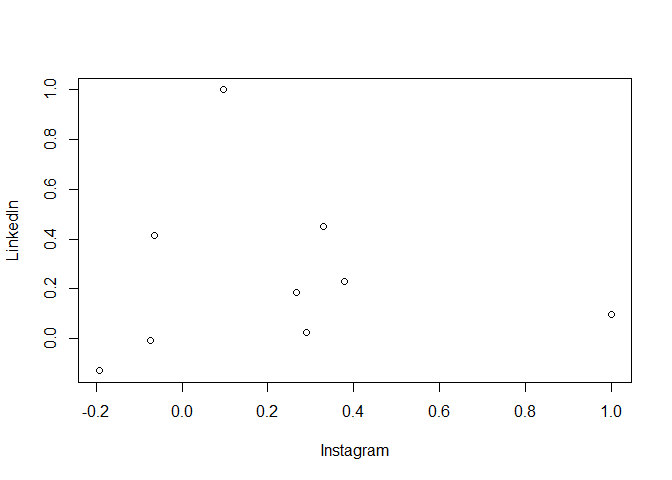<!-- -->

``` r
social_pca <- prcomp(social_media_numeric, scale=TRUE)
summary(social_pca)
```

    ## Importance of components:
    ##                          PC1    PC2    PC3    PC4     PC5     PC6    PC7
    ## Standard deviation     1.636 1.4776 1.3280 1.1739 0.98548 0.92264 0.8974
    ## Proportion of Variance 0.223 0.1819 0.1470 0.1148 0.08093 0.07094 0.0671
    ## Cumulative Proportion  0.223 0.4049 0.5519 0.6667 0.74767 0.81861 0.8857
    ##                            PC8     PC9    PC10    PC11   PC12
    ## Standard deviation     0.76608 0.63298 0.47850 0.34662 0.1866
    ## Proportion of Variance 0.04891 0.03339 0.01908 0.01001 0.0029
    ## Cumulative Proportion  0.93462 0.96801 0.98709 0.99710 1.0000

``` r
plot(social_pca)
```

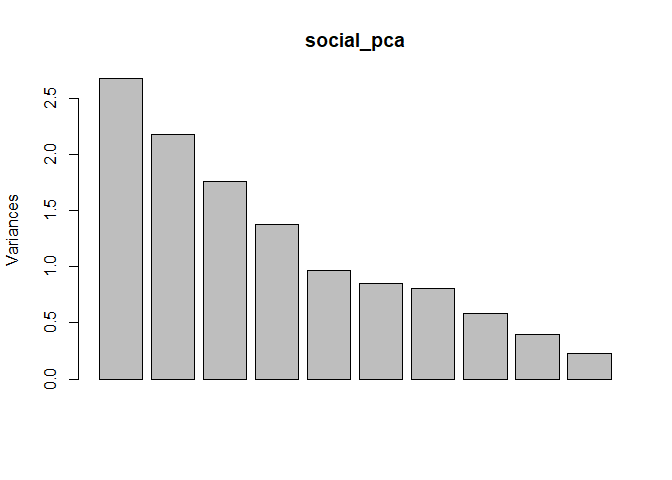<!-- -->

``` r
biplot(fit.pc)
```

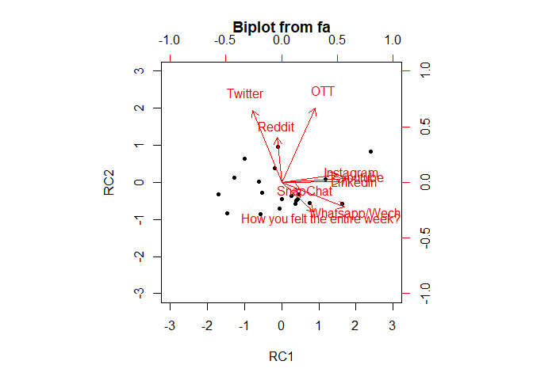<!-- -->

<p>
Overall, these techniques complement each other and can be used together
to gain a comprehensive understanding of the data, uncover hidden
patterns and structures, and derive meaningful insights for
decision-making and further analysis
</p>

#### Multiple Regression Analysis

``` r
library(dplyr)
library(readxl)
library(car)
```

    ## Warning: package 'car' was built under R version 4.3.2

    ## Loading required package: carData

    ## Warning: package 'carData' was built under R version 4.3.2

    ## 
    ## Attaching package: 'car'

    ## The following object is masked from 'package:psych':
    ## 
    ##     logit

    ## The following object is masked from 'package:dplyr':
    ## 
    ##     recode

``` r
library(ggplot2)
library(GGally)
```

    ## Warning: package 'GGally' was built under R version 4.3.2

    ## Registered S3 method overwritten by 'GGally':
    ##   method from   
    ##   +.gg   ggplot2

``` r
social_media <- read_excel("social_media_cleaned.xlsx")
social_media_numeric <- select_if(social_media, is.numeric)
```

#### Model Development

``` r
model <- lm(social_media_numeric$Trouble_falling_asleep  ~ social_media_numeric$Instagram + social_media_numeric$LinkedIn + social_media_numeric$SnapChat + social_media_numeric$Twitter + social_media_numeric$`Whatsapp/Wechat` + social_media_numeric$youtube + social_media_numeric$OTT + social_media_numeric$Reddit,
  data = social_media_numeric
)
summary(model)
```

    ## 
    ## Call:
    ## lm(formula = social_media_numeric$Trouble_falling_asleep ~ social_media_numeric$Instagram + 
    ##     social_media_numeric$LinkedIn + social_media_numeric$SnapChat + 
    ##     social_media_numeric$Twitter + social_media_numeric$`Whatsapp/Wechat` + 
    ##     social_media_numeric$youtube + social_media_numeric$OTT + 
    ##     social_media_numeric$Reddit, data = social_media_numeric)
    ## 
    ## Residuals:
    ##      Min       1Q   Median       3Q      Max 
    ## -0.47240 -0.26171 -0.04857  0.14431  0.71319 
    ## 
    ## Coefficients:
    ##                                        Estimate Std. Error t value Pr(>|t|)  
    ## (Intercept)                             0.02935    0.36730   0.080    0.938  
    ## social_media_numeric$Instagram          0.07008    0.03479   2.014    0.067 .
    ## social_media_numeric$LinkedIn          -0.02846    0.04682  -0.608    0.555  
    ## social_media_numeric$SnapChat           0.05725    0.03387   1.690    0.117  
    ## social_media_numeric$Twitter            0.03816    0.14738   0.259    0.800  
    ## social_media_numeric$`Whatsapp/Wechat` -0.02922    0.03663  -0.798    0.441  
    ## social_media_numeric$youtube            0.04025    0.07350   0.548    0.594  
    ## social_media_numeric$OTT               -0.02642    0.05020  -0.526    0.608  
    ## social_media_numeric$Reddit            -0.02379    0.06667  -0.357    0.727  
    ## ---
    ## Signif. codes:  0 '***' 0.001 '**' 0.01 '*' 0.05 '.' 0.1 ' ' 1
    ## 
    ## Residual standard error: 0.4432 on 12 degrees of freedom
    ## Multiple R-squared:  0.495,  Adjusted R-squared:  0.1583 
    ## F-statistic:  1.47 on 8 and 12 DF,  p-value: 0.2639

<p>
In this step, I loaded the dataset and fitted a multiple regression
model using the lm() function. The model predicts the How you felt the
entire week? based on several predictor variables like: Instagram,
LinkedIn, SnapChat, Twitter, Whatsapp, Youtube, OTT and Reddit
acceleration.
</p>
<p>
The statistical significance of each coefficient, we look at their
corresponding t-values and p-values. If a predictor variable has a low
p-value (usually less than 0.05), it suggests that the variable is
statistically significant in explaining the variability in trouble with
sleep. In simpler terms, it means that the variable likely has a genuine
impact on sleep issues.
</p>

#### Model Acceptance

``` r
coefficients(model)
```

    ##                            (Intercept)         social_media_numeric$Instagram 
    ##                             0.02935003                             0.07007642 
    ##          social_media_numeric$LinkedIn          social_media_numeric$SnapChat 
    ##                            -0.02846038                             0.05724962 
    ##           social_media_numeric$Twitter social_media_numeric$`Whatsapp/Wechat` 
    ##                             0.03816260                            -0.02922242 
    ##           social_media_numeric$youtube               social_media_numeric$OTT 
    ##                             0.04025224                            -0.02641988 
    ##            social_media_numeric$Reddit 
    ##                            -0.02379311

``` r
confint(model,level=0.95)
```

    ##                                               2.5 %     97.5 %
    ## (Intercept)                            -0.770927154 0.82962722
    ## social_media_numeric$Instagram         -0.005728035 0.14588087
    ## social_media_numeric$LinkedIn          -0.130465001 0.07354424
    ## social_media_numeric$SnapChat          -0.016539324 0.13103857
    ## social_media_numeric$Twitter           -0.282947122 0.35927233
    ## social_media_numeric$`Whatsapp/Wechat` -0.109032432 0.05058759
    ## social_media_numeric$youtube           -0.119892516 0.20039700
    ## social_media_numeric$OTT               -0.135799283 0.08295953
    ## social_media_numeric$Reddit            -0.169058947 0.12147272

``` r
fitted(model)
```

    ##           1           2           3           4           5           6 
    ##  0.03767577  0.68297470 -0.14111191  0.20249080  0.85568960 -0.12780750 
    ##           7           8           9          10          11          12 
    ##  0.23700749  0.28681294  0.47239558  0.13256374  0.41692826  0.27284963 
    ##          13          14          15          16          17          18 
    ##  1.09915634  0.43420708  0.04857065  0.41826973  0.41113911  0.32212351 
    ##          19          20          21 
    ##  0.26171236  0.88332910 -0.20697699

#### Residual Analysis

``` r
residuals(model)
```

    ##           1           2           3           4           5           6 
    ## -0.03767577  0.31702530  0.14111191 -0.20249080  0.14431040  0.12780750 
    ##           7           8           9          10          11          12 
    ## -0.23700749  0.71318706 -0.47239558 -0.13256374  0.58307174 -0.27284963 
    ##          13          14          15          16          17          18 
    ## -0.09915634 -0.43420708 -0.04857065  0.58173027 -0.41113911 -0.32212351 
    ##          19          20          21 
    ## -0.26171236  0.11667090  0.20697699

``` r
anova(model)
```

    ## Analysis of Variance Table
    ## 
    ## Response: social_media_numeric$Trouble_falling_asleep
    ##                                        Df  Sum Sq Mean Sq F value  Pr(>F)  
    ## social_media_numeric$Instagram          1 1.19181 1.19181  6.0682 0.02985 *
    ## social_media_numeric$LinkedIn           1 0.14215 0.14215  0.7238 0.41156  
    ## social_media_numeric$SnapChat           1 0.54677 0.54677  2.7839 0.12108  
    ## social_media_numeric$Twitter            1 0.00972 0.00972  0.0495 0.82772  
    ## social_media_numeric$`Whatsapp/Wechat`  1 0.26490 0.26490  1.3488 0.26808  
    ## social_media_numeric$youtube            1 0.04226 0.04226  0.2152 0.65103  
    ## social_media_numeric$OTT                1 0.08720 0.08720  0.4440 0.51780  
    ## social_media_numeric$Reddit             1 0.02501 0.02501  0.1274 0.72739  
    ## Residuals                              12 2.35684 0.19640                  
    ## ---
    ## Signif. codes:  0 '***' 0.001 '**' 0.01 '*' 0.05 '.' 0.1 ' ' 1

``` r
plot(model)
```

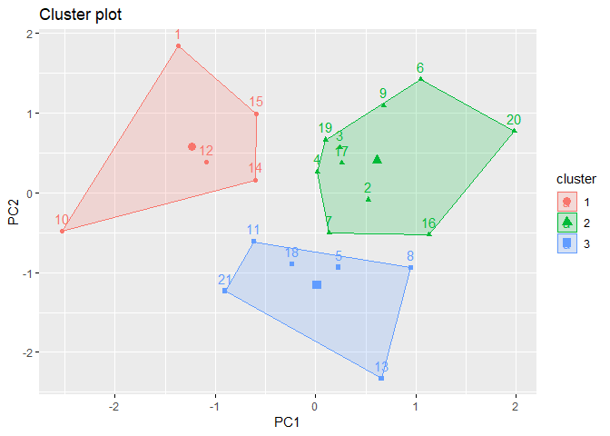<!-- -->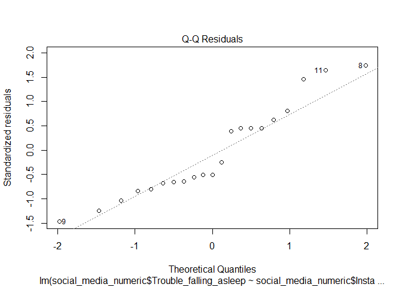<!-- -->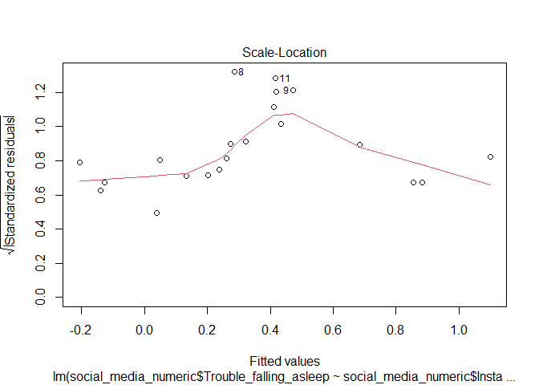<!-- -->

    ## Warning in sqrt(crit * p * (1 - hh)/hh): NaNs produced

    ## Warning in sqrt(crit * p * (1 - hh)/hh): NaNs produced

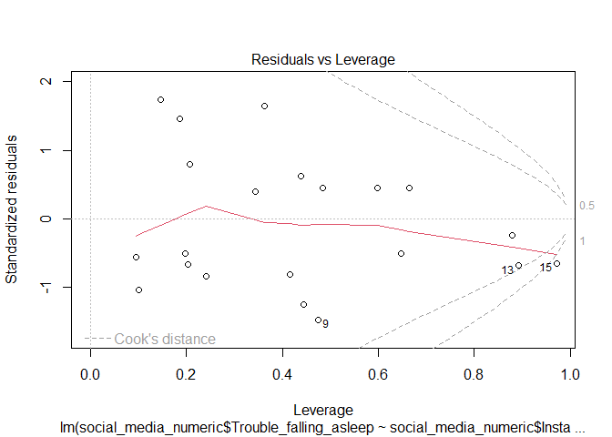<!-- -->

``` r
avPlots(model)
```

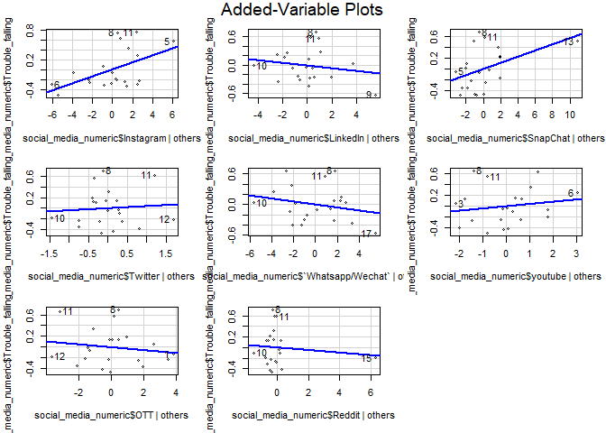<!-- -->

``` r
cutoff <- 17/((nrow(social_media)-length(model$coefficients)-2))
plot(model, which=4, cook.levels=cutoff)
```

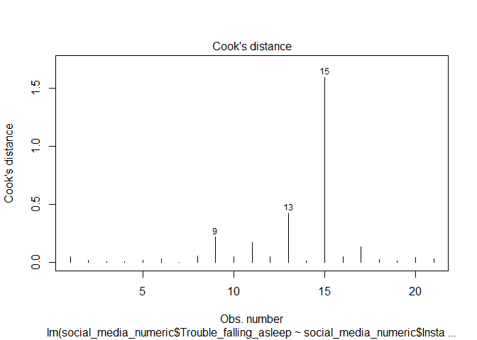<!-- -->

``` r
influencePlot(model, id.method="identify", main="Influence Plot", sub="Circle size is proportial to Cook's Distance" )
```

    ## Warning in plot.window(...): "id.method" is not a graphical parameter

    ## Warning in plot.xy(xy, type, ...): "id.method" is not a graphical parameter

    ## Warning in axis(side = side, at = at, labels = labels, ...): "id.method" is not
    ## a graphical parameter

    ## Warning in axis(side = side, at = at, labels = labels, ...): "id.method" is not
    ## a graphical parameter

    ## Warning in box(...): "id.method" is not a graphical parameter

    ## Warning in title(...): "id.method" is not a graphical parameter

    ## Warning in plot.xy(xy.coords(x, y), type = type, ...): "id.method" is not a
    ## graphical parameter

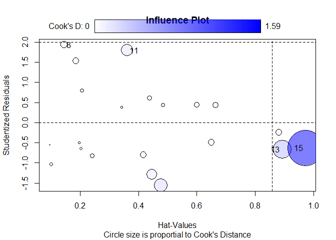<!-- -->

    ##       StudRes       Hat      CookD
    ## 8   1.9283209 0.1457607 0.05747738
    ## 11  1.7930758 0.3622253 0.17127619
    ## 13 -0.6643396 0.8918546 0.42415845
    ## 15 -0.6322389 0.9714537 1.59103287

``` r
qqPlot(model, main="QQ Plot")
```

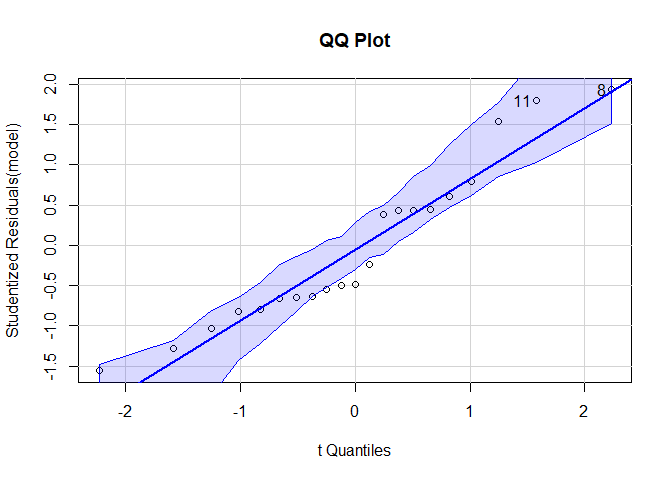<!-- -->

    ## [1]  8 11

``` r
ggpairs(data=social_media_numeric, title="Social Media")
```

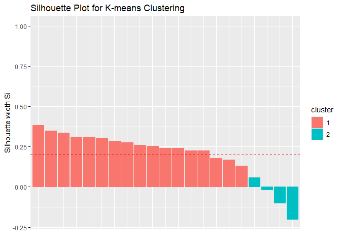<!-- -->

``` r
ggplot(social_media_numeric, aes(x = fitted(model), y = residuals(model))) +
  geom_point(alpha = 0.5) +
  labs(title = "Residuals vs Fitted Values", x = "Fitted Values", y = "Residuals")
```

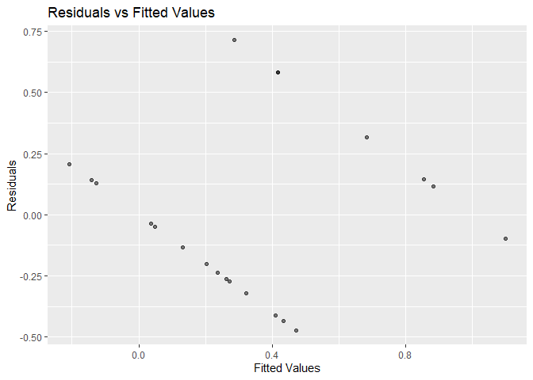<!-- -->
<p>
The residual vs. fitted plot is a tool used to evaluate the assumptions
and adequacy of a regression model. It helps to identify whether the
model adequately captures the underlying relationships in the data or if
there are issues that need to be addressed. The plot shows a pattern of
points around zero, the model is not appropriate.
</p>

#### Prediction

<p>
The predict() function will generate predicted values of the dependent
variable (Total_revenue) based on the provided predictors.
</p>

``` r
new_data_pd <- data.frame(
  character = "masinl",
  Instagram = 3.50,
  LinkedIn = 4.00,
  SnapChat = 1.00,
  Twitter = 5.00,
  `Whatsapp/Wechat` = 1.00,
  youtube = 2.50,
  OTT = 14.50,
  Reddit = 2.50,
  Trouble_falling_asleep = 0,
  Mood = 1,
  Productivity = 0,
  Tired_waking_up_in_morning = 3,
  `How you felt the entire week?` = 3
)

predicted_pd <- predict(model, newdata = new_data_pd)
```

    ## Warning: 'newdata' had 1 row but variables found have 21 rows

``` r
predicted_pd
```

    ##           1           2           3           4           5           6 
    ##  0.03767577  0.68297470 -0.14111191  0.20249080  0.85568960 -0.12780750 
    ##           7           8           9          10          11          12 
    ##  0.23700749  0.28681294  0.47239558  0.13256374  0.41692826  0.27284963 
    ##          13          14          15          16          17          18 
    ##  1.09915634  0.43420708  0.04857065  0.41826973  0.41113911  0.32212351 
    ##          19          20          21 
    ##  0.26171236  0.88332910 -0.20697699

``` r
summary(predicted_pd)
```

    ##    Min. 1st Qu.  Median    Mean 3rd Qu.    Max. 
    ## -0.2070  0.1326  0.2868  0.3333  0.4342  1.0992

#### Model Accuracy

``` r
rsquared <- summary(model)$r.squared
cat("R-squared:", rsquared, "\n")
```

    ## R-squared: 0.494963

``` r
adjusted_rsquared <- summary(model)$adj.r.squared
cat("Adjusted R-squared:", adjusted_rsquared, "\n")
```

    ## Adjusted R-squared: 0.1582717

``` r
predictions <- predict(model)
rmse <- sqrt(mean((social_media$Instagram - predictions)^2))
cat("RMSE:", rmse, "\n")
```

    ## RMSE: 6.442152
