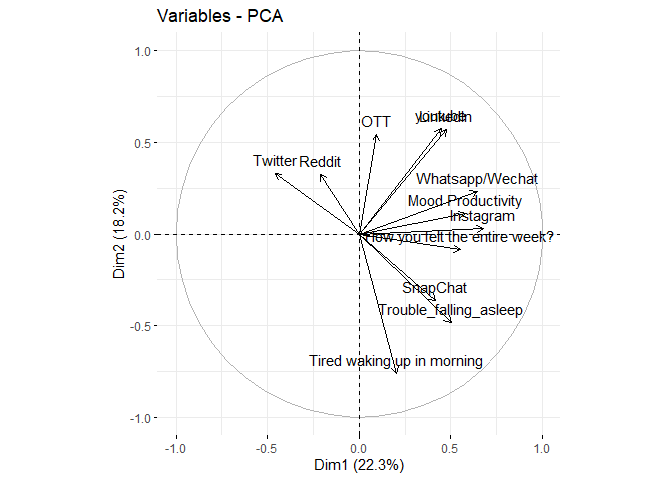
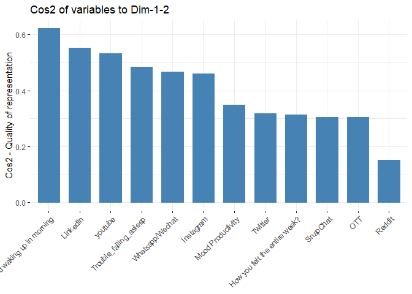

Social Media
================
Satya Shiva Sai Ram Kamma
2024-03-25

``` r
library(readxl)
```

    ## Warning: package 'readxl' was built under R version 4.3.2

``` r
library(dplyr)
```

    ## 
    ## Attaching package: 'dplyr'

    ## The following objects are masked from 'package:stats':
    ## 
    ##     filter, lag

    ## The following objects are masked from 'package:base':
    ## 
    ##     intersect, setdiff, setequal, union

``` r
library(FactoMineR)
```

    ## Warning: package 'FactoMineR' was built under R version 4.3.3

``` r
library(factoextra)
```

    ## Warning: package 'factoextra' was built under R version 4.3.2

    ## Loading required package: ggplot2

    ## Welcome! Want to learn more? See two factoextra-related books at https://goo.gl/ve3WBa

``` r
social_media <- read_excel("social_media_cleaned.xlsx")

social_media_numeric <- select_if(social_media, is.numeric)

# Perform PCA
pca_result <- prcomp(social_media_numeric, scale = TRUE)

# Scree plot
plot(pca_result$sdev^2, type = "b", xlab = "Principal Component", ylab = "Variance Explained")
```

<!-- -->

``` r
# Loadings
loadings <- pca_result$rotation
print(loadings)
```

    ##                                       PC1          PC2         PC3        PC4
    ## Instagram                      0.35997253 -0.235305731 -0.48074695  0.1123396
    ## LinkedIn                       0.39149535 -0.188256641  0.42154260 -0.2431677
    ## SnapChat                       0.14434470 -0.001375426 -0.53148137 -0.5851768
    ## Twitter                       -0.38928919 -0.485292758  0.14824132 -0.2290724
    ## Whatsapp/Wechat                0.49712209  0.001226222 -0.14994837  0.2121451
    ## youtube                        0.43321201 -0.232497668  0.25452061  0.3341619
    ## OTT                            0.02991209 -0.694285079 -0.10777759 -0.1630966
    ## Reddit                        -0.14824451 -0.346301530  0.09853811  0.2831951
    ## How you felt the entire week?  0.29511949  0.132915416  0.42207257 -0.5194936
    ##                                       PC5         PC6        PC7         PC8
    ## Instagram                      0.13976700 -0.31408369  0.4516641 -0.49586684
    ## LinkedIn                      -0.11932387 -0.28841101 -0.5352279 -0.41219103
    ## SnapChat                      -0.34293942 -0.16571370 -0.1349190  0.39502630
    ## Twitter                        0.31769932  0.03070392  0.1596447  0.04109432
    ## Whatsapp/Wechat                0.03955265  0.70875864 -0.1526895  0.02249668
    ## youtube                        0.10599868 -0.36788501  0.1356451  0.64454084
    ## OTT                            0.13238183  0.29590419 -0.1450540  0.06870679
    ## Reddit                        -0.84276046  0.07699596  0.1923146 -0.07462750
    ## How you felt the entire week? -0.08435896  0.24207624  0.6050635 -0.01585044
    ##                                       PC9
    ## Instagram                     -0.05696856
    ## LinkedIn                      -0.14378008
    ## SnapChat                      -0.18692529
    ## Twitter                       -0.63987847
    ## Whatsapp/Wechat               -0.39705749
    ## youtube                       -0.03767887
    ## OTT                            0.58992497
    ## Reddit                        -0.09727197
    ## How you felt the entire week?  0.12308003

``` r
# Data projection onto all PCs
data_projection_all <- as.data.frame(pca_result$x)

# Matrix scatterplot for pairs of principal components
pairs(data_projection_all, col = "blue", pch = 19,
      main = "Data Visualization using All PCs")
```

<!-- -->

``` r
# Visualize Eigenvalues
fviz_eig(pca_result, addlabels = TRUE)
```

<!-- -->

``` r
# Visualize Variable Quality
fviz_pca_var(pca_result, col.var = "cos2",
             gradient.cols = c("#00AFBB", "#E7B800", "#FC4E07"), 
             repel = TRUE)
```

<!-- -->

``` r
# Visualize Individual Contributions
fviz_pca_ind(pca_result,
             geom.ind = "point", # Show points only
             palette = c("#00AFBB", "#E7B800", "#FC4E07"),
             addEllipses = TRUE, # Concentration ellipses
             legend.title = "Groups"
             )
```

<!-- -->

``` r
# Biplot
biplot(pca_result)
```

<!-- -->

``` r
# Variable correlation plot (Correlation Circle)
fviz_pca_var(pca_result, col.var = "black")
```

<!-- -->

``` r
# Quality of representation of variables on dimensions 1 and 2
fviz_cos2(pca_result, choice = "var", axes = 1:2)
```

<!-- -->

``` r
# Contributions of variables to principal components
fviz_contrib(pca_result, choice = "var", axes = 1, top = 10)
```

<!-- -->

``` r
fviz_contrib(pca_result, choice = "var", axes = 2, top = 10)
```

<!-- -->

``` r
# Visualize individual contributions
fviz_pca_ind(pca_result,
             geom.ind = "point", # Show points only
             palette = c("#00AFBB", "#E7B800", "#FC4E07"),
             addEllipses = TRUE, # Concentration ellipses
             legend.title = "Groups"
             )
```

<!-- -->

``` r
# 3D scatterplot of the first three principal components
library(scatterplot3d)
scatterplot3d(pca_result$x[,1:3], color = social_media$Instagram)
```

<!-- -->
